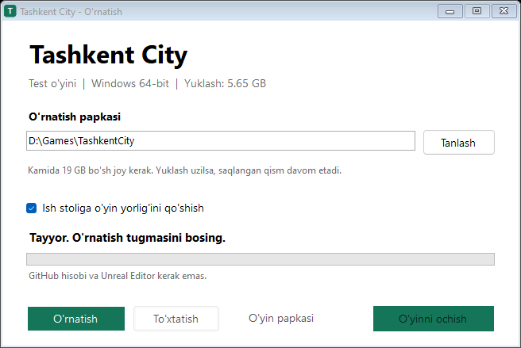

# Tashkent City — Windows test o‘yini

Tashkent City, AUT universiteti, park va Humo Arena atrofida haydash va erkin yurish uchun **alpha test versiyasi**. O‘zbekcha, English va Russian tillari mavjud.

## O‘yinni yuklash

### [Install.TashkentCity.exe — yangi versiyani yuklash](https://github.com/Shahzod1602/Tashkentcity-gtastyle/releases/download/alpha-20261011-city-feedback/Install.TashkentCity.exe)

**Versiya: alpha-20261011-city-feedback · 2026-10-11**

1. Yuqoridagi **bitta faylni** yuklab oching.
2. O‘yin uchun papka tanlang va **O‘rnatish** tugmasini bosing.
3. Tugagach **O‘yinni ochish** tugmasini bosing.
4. Asosiy menyuda **Tashkent City / Lyra** ni tanlang — yangilangan shahar rejimi shu yerda.

Installer **5.65 GB** paketni yuklaydi, tekshiradi va avtomatik chiqaradi. Internet uzilsa o‘sha papkani tanlab davom ettiring. Windows x64, internet va o‘rnatish davomida kamida **19 GB bo‘sh joy** kerak. O‘rnatilgan o‘yin taxminan **6.22 GB** joy egallaydi. GitHub hisobi, Unreal Editor va 7-Zip talab qilinmaydi. Installer raqamli imzo bilan imzolanmagan.

`VCRUNTIME` yoki `MSVCP` yetishmasa, o‘yin papkasidagi **Install Runtime.cmd** ni oching. Avval **Muvozanatli / Balanced** grafikadan boshlang.

Oldingi o‘rnatish o‘z papkasida qoladi. Progress va sozlamalar `%LOCALAPPDATA%\TashkentCityTest` ichida saqlanadi. Lyra shahar rejimi eski rejimlardan alohida profil ishlatadi. Yangi installer yaratgan yorliq yoki o‘yin papkasini oching.

## Bu versiyadagi yangiliklar

- Lyra asosidagi yurish, jang va qurol animatsiyalari; pistolet, avtomat, shotgun; qurolni yig‘ishtirish va personaj tanlash.
- AUT yaqinidagi tekshirilgan yo‘l balandliklari va asfalt ustiga chiqib qolgan qoplamalar tuzatildi.
- AUT zinapoya va kirish maydonchasi, maysa teksturasi, daraxt/butalar va to‘rtta parking joyi yaxshilandi.
- Mashinadan tushish holati, xavfsiz chiqish, fokus yo‘qolgandagi gaz/rul va parkingda yengil gaz bilan yurish tuzatildi.
- O‘q zaxirasi, bepul o‘q/bronya olish va tez bosib qo‘yib yuborishda otish tuzatildi.
- O‘q tekkan ko‘cha chirog‘i o‘chadi; shikastlangan mashinada tutun va portlash effekti, mashina urgan bekat belgisida yiqilish bor.

**Lyra boshqaruvi:** WASD — yurish/haydash; E — to‘xtagan mashinaga kirish/chiqish; Space — sakrash/qo‘l tormozi; G — garaj; M — xarita; Esc — menyu. Piyoda H — qurolni olish/yig‘ishtirish; 1/2/3 — pistolet/avtomat/shotgun; o‘ng sichqoncha — nishon; chap sichqoncha — otish; R — qayta o‘qlash. Mashinada C — kamera; B — radio; N — keyingi trek; L — faralar. **Esc → Jang** ichidan qidiruvsiz holatda bepul o‘q va bronya olish mumkin.

## Sinov va cheklovlar

Yakuniy o‘yin fayli bo‘yicha **7 ta avtomatik sinov to‘plami o‘tdi**, **21 ta o‘yin rasmi** ko‘rib chiqildi. Toza paket menyusi tekshirildi. Installerning **24 ta tekshiruvi** o‘tdi, o‘rnatilgan **186 ta fayl** hajmi va SHA-256 bo‘yicha solishtirildi. Shaxsiy save’lar, developer loglari, debug fayllari va Unreal loyihasining manba kodi paketga qo‘shilmagan.

RTX 3050 Laptop 4 GB, Ryzen 5 6600H, 16 GB RAM; 1280×720 Balanced DX11; bir xil 180 soniyalik kunduz/tun/salon marshruti:

| Ko‘rsatkich | Avval | Yangi |
|---|---:|---:|
| O‘rtacha FPS | 42,58 | 41,80 |
| p95 kadr vaqti | 34,24 ms | 32,98 ms |
| p99 kadr vaqti | 41,27 ms | 37,99 ms |

Bu bittadan solishtirma o‘lchov; boshqa PC uchun kafolat emas. Odam/transport limitlari kamaytirilmagan. **16,7 ms maqsadiga hali yetilmagan.** RTX 5080, toza PC’da runtime o‘rnatish va to‘liq poyga aylanasi bu release uchun qayta tekshirilmagan.

Bu tugallanmagan alpha. Shahar to‘liq 1:1 rekonstruksiya emas; ayrim binolar va mashina materiallari oddiy. Oltita feedback guruhi uchun aniq joy yoki izoh kerak, bitta HUD masalasi qisman hal qilingan. Mashinalarni navbatdagi vizual yaxshilash bosqichi bu release’ga kirmaydi.

## Feedback

[Issues](https://github.com/Shahzod1602/Tashkentcity-gtastyle/issues) bo‘limiga PC tarkibi, grafik sozlamalari, **aniq xarita joyi**, mashina/personaj, takrorlash qadamlari va rasm yoki qisqa video yozing. `FEEDBACK_TEMPLATE.txt` paket ichida bor. Fikrlar va loglar avtomatik yuborilmaydi.

## Qo‘lda yuklash

[Release sahifasidan](https://github.com/Shahzod1602/Tashkentcity-gtastyle/releases/tag/alpha-20261011-city-feedback) barcha raqamlangan ZIP qismlari, **Join.Test.ZIP.cmd**, **Join-Test-ZIP.ps1** va **TEST_PARTS.json** ni bitta papkaga yuklang. Join.Test.ZIP.cmd ni oching, yig‘ilgan ZIP ni to‘liq chiqaring va **Play Tashkent City.cmd** ni oching. GitHub’ning avtomatik `Source code` arxivlari o‘yin paketi emas.

Asset manbalari va mavjud litsenziya qaydlari `SourceNotices` ichida. Bu repository uchinchi tomon assetlariga yangi litsenziya bermaydi.

## English quick start

[Download Install.TashkentCity.exe](https://github.com/Shahzod1602/Tashkentcity-gtastyle/releases/download/alpha-20261011-city-feedback/Install.TashkentCity.exe), choose a folder and click **O‘rnatish** (Install). Then click **O‘yinni ochish** (Open game) and select **Tashkent City / Lyra** in the main menu. Interrupted downloads resume in the same folder. The download is **5.65 GB**; allow **19 GB** free during installation. Windows x64 is required; Unreal Editor and a GitHub account are not required.

The new alpha includes Lyra city movement/weapons, AUT road/stairs/parking improvements, vehicle exit/input fixes, ammunition fixes, shootable streetlights and vehicle damage effects. Existing tester saves remain under `%LOCALAPPDATA%\TashkentCityTest`. Start with Balanced graphics and report issues with exact locations and reproduction steps. The performance table is one measured laptop comparison, not a performance guarantee.
